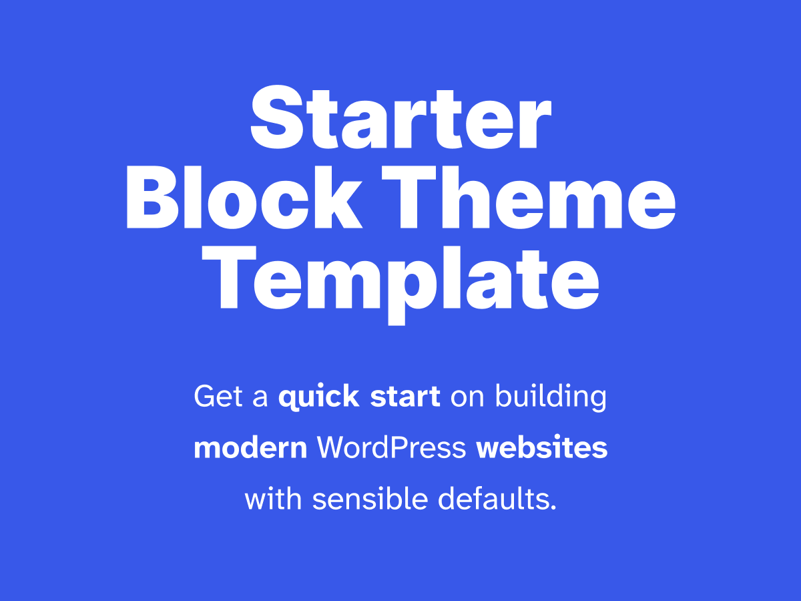

# themename

---

## Features

### Custom Post Types (CPT)

### Pages

### Blog

#### Categories

#### Tags

### Custom fields

## Project planning and management

- GitHub project:
- Milestones:
- Design development planning:

## Project development

0. [**Production site setup**](./docs/0-production-site-setup.md)
1. [**Local site setup**](./docs/1-local-site-setup.md)
2. [**Theme setup**](./docs/2-theme-setup.md)
3. [**Theme structure**](./docs/3-theme-structure.md)
4. [**Theme development and deployment**](./docs/4-theme-development-and-deployment.md)
5. [**Asset URL rewriting**](./docs/5-asset-url-rewriting.md)
